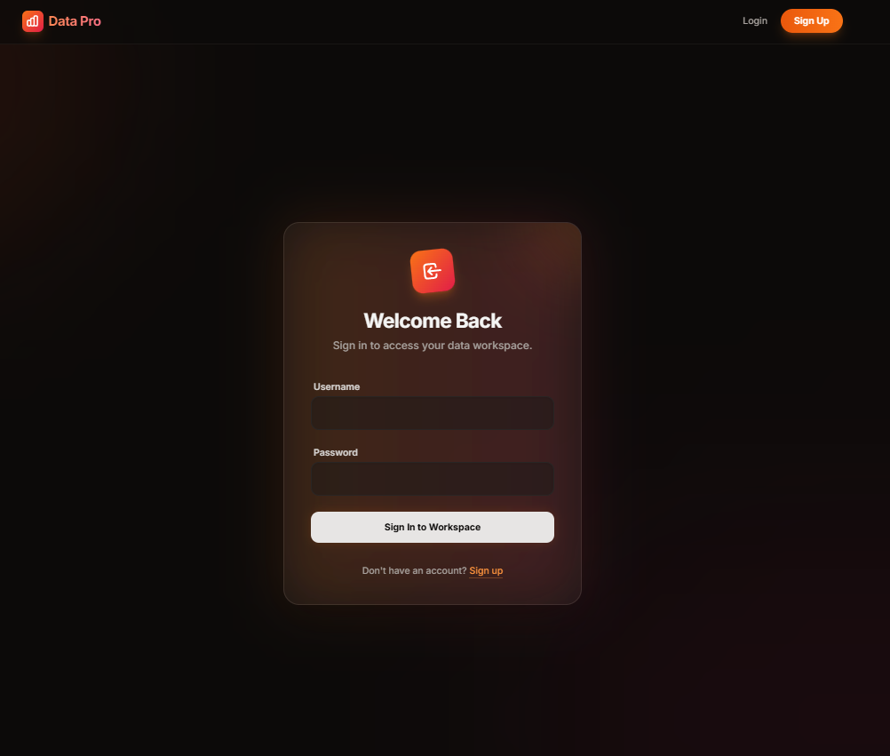
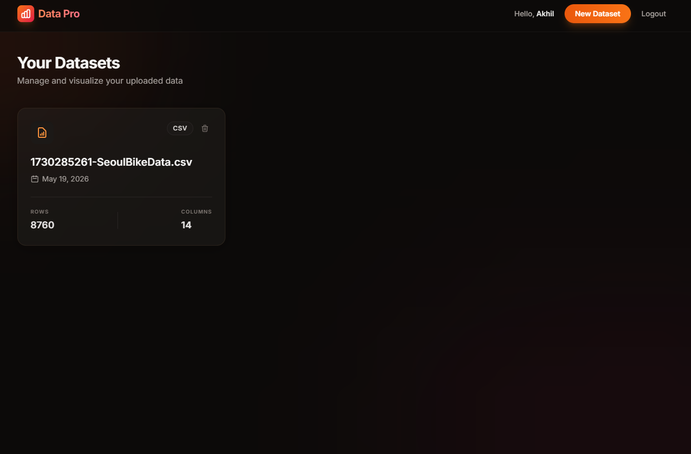
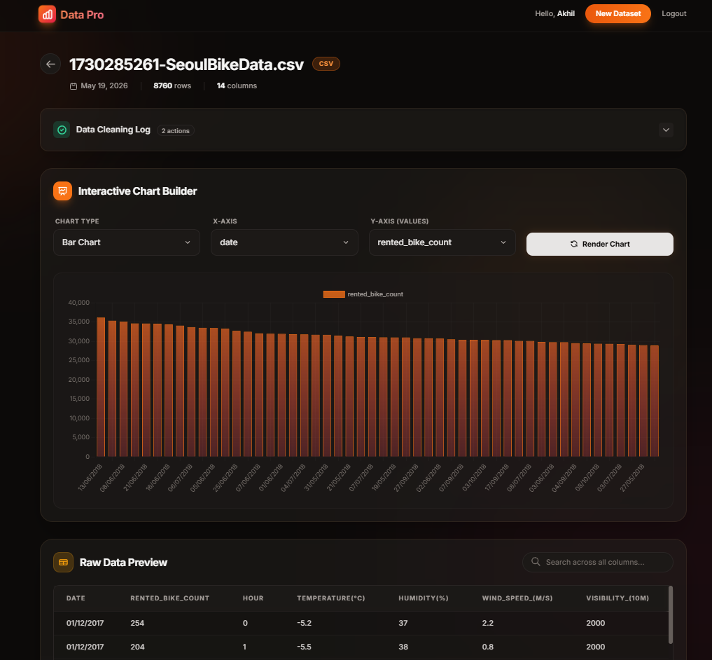

# Data Pro

Data Pro is a Django-based web application that allows users to securely upload datasets (CSV/Excel), view raw data, check data cleaning logs, and interactively build charts for data visualization.

## Features
- **User Authentication**: Secure login and signup.
- **Dataset Management**: Upload, manage, and delete datasets securely in your workspace.
- **Data Visualization**: Interactive chart builder (e.g., Bar Charts) with customizable X and Y axes.
- **Data Preview**: View raw tabular data seamlessly within the application.
- **Data Cleaning Log**: Keep track of applied data cleaning and transformation steps.

## Screenshots

### Login Page


### Dashboard


### Interactive Chart Builder


*(Note: Please save the screenshots you provided into the `screenshots` folder and name them `login.png`, `dashboard.png`, and `chart_builder.png` so they show up here.)*

## Tech Stack
- **Backend**: Django (Python)
- **Data Processing**: Pandas, OpenPyXL
- **Frontend**: HTML, CSS, JavaScript (Vanilla CSS/Modern UI)

## Installation

1. Clone the repository:
   ```bash
   git clone <repository-url>
   cd DATA_PRO
   ```

2. Create a virtual environment and activate it:
   ```bash
   python -m venv venv
   source venv/bin/activate  # On Windows, use `venv\Scripts\activate`
   ```

3. Install dependencies:
   ```bash
   pip install -r requirements.txt
   ```

4. Apply migrations:
   ```bash
   python manage.py migrate
   ```

5. Run the development server:
   ```bash
   python manage.py runserver
   ```
   Alternatively, you can use the provided `run.bat` (Windows) or `run.sh` (Linux/Mac) scripts.

6. Access the application at `http://127.0.0.1:8000`.

## License
This project is licensed under the MIT License - see the [LICENSE](LICENSE) file for details.
